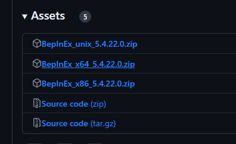
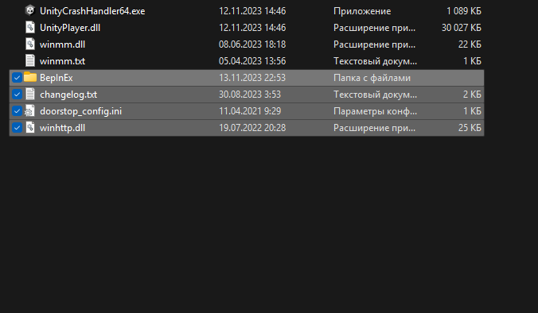
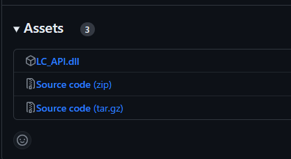
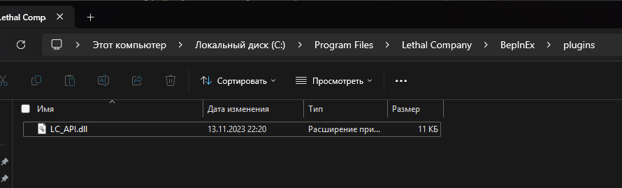
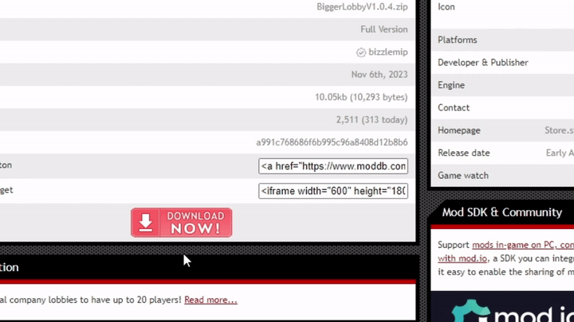
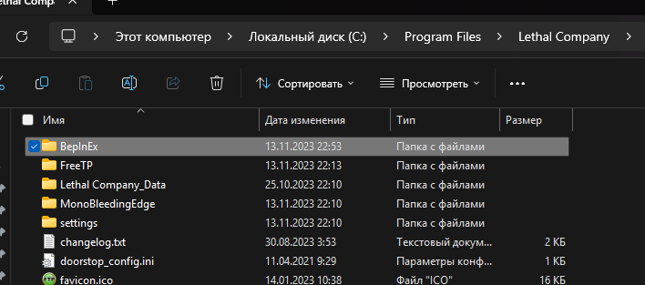
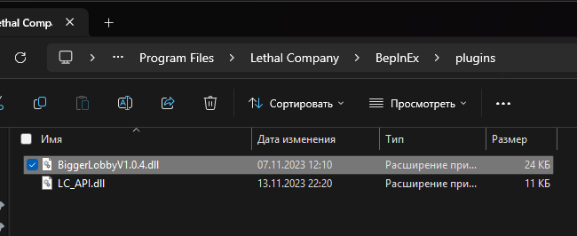
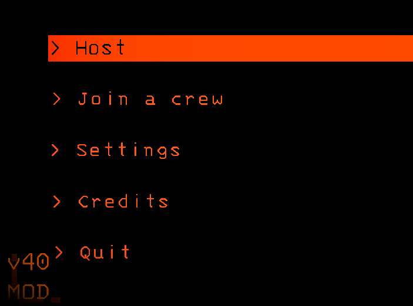

# Вариантики установки
Либо прочитайте инструкцию, либо скачайте этот архив и расспакуйте в папку с игрой (хуй знает может не сработает)

👉[СУКА ЭТОТ АРХИВ](<./BepInEx-With-BiggerLobby.zip>)

# **Инструкция по установке мода BiggerLobby**

## 1. Установите BepInEx

### 1.1. Загрузка BepInEx

Перейдите по этой [ссылке](<https://github.com/BepInEx/BepInEx/releases/>) и скачайте BepInEx_x64_X.X.XX.X.zip

### 1.2. Установка BepInEx

Распакуйте архив в папку с игрой

### 1.3. Запустите игру для инициализации BepInEx

Выберете `Online` или `LAN`, после того как окажетесь в меню, выйдите из игры

## 2. Установите LC_API.dll

### 2.1. Загрузка LC_API.dll

Перейдите по этой [ссылке](<https://github.com/u-2018/LC-API/releases/tag/v1.3.3>)

Скачайте `LC_API.dll`. Браузер может выёбываться, всё равно скачивайте.

### 2.2 Установка LC_API.dll

Поместите файл в `<Папка с игрой>\BepInEx\plugins`

## 3. Установка BiggerLobby

### 3.1. Загрузка BiggerLobby

Перейдите по этой [ссылке](<https://www.moddb.com/games/lethal-company/downloads/bigger-lobby>)

### 3.2. Установка BiggerLobby

Распакуйте архив в папку с игрой

Папка `<Папка с игрой>\BepInEx\plugins` должна содержать `BiggerLobbyV1.0.4.dll`

Поздравляю! Вы успешно (надеюсь) установили Biggerlobby!

# ***Обратите внимание!***

Если вы правильно установили мод, вы должны увидеть надпись `MOD` под номером версии

